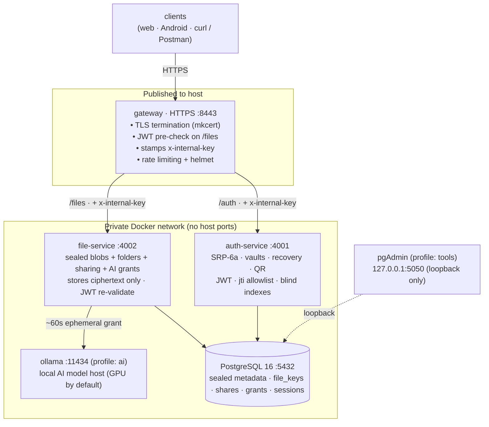

# CloudCast

CloudCast is a self-hostable private file store and sharing app, built to run on your own
hardware - a spare PC at home or a corporate server. Its defining trait is a **blind server**: the
backend stores and relays only encrypted blobs and never holds a key that can open your files, their
names, or their contents. Your keys live on the client and your password never reaches the server,
yet search and optional local AI still work.

---

## How it works

- **Login uses SRP-6a**, so the server only ever stores a verifier - never your password.
- **Your keys stay on the device.** Your password derives an Argon2id vault key that unlocks your
  X25519 secret key; a recovery code is the backup way in.
- **Files are sealed client-side.** Each gets a random AES-256-GCM key (a DEK, format `CCE3`) sealed
  to your public key in `file_keys` - one entry for you, one per person you share with. Names are
  sealed under a separate per-user key.
- **AI is the one exception.** Running a model on a file issues a ~60-second, single-use grant that
  lets the server decrypt *that one file*, process it, and discard the plaintext. Nothing else -
  storage, listings, sharing, search - ever needs a key.

---

## Features

- **Blind storage** - files encrypted client-side (AES-256-GCM, `CCE3`) as opaque blobs on disk; the
  DB only points at them. Names sealed under a per-user metadata key.
- **SRP-6a auth** - the password is never transmitted; the server stores only an SRP verifier.
  Register / login / logout, JWT with a server-side session allowlist (logout truly revokes), change
  password / email, **recovery-code** reset, and a **regenerate recovery code** flow.
- **Grace-period account deletion** - deleting your account schedules a purge; if you have files
  shared with recipients who can save a copy, they're notified and given a window to do so before the
  sweeper hard-deletes everything you own. Cancel any time before the window closes.
- **Passwordless QR sign-in** - an already-signed-in device approves a new one via a blind vault
  transfer; the pairing code is stored hashed and the session token is sealed to the new device.
- **Files & folders** - upload, download, rename, move, delete, favourites, a folder hierarchy with a
  cycle guard, and client-side name-conflict resolution.
- **Sharing with permissions** - share by email (exact blind-index match) at one of two
  tiers - **view** (preview only) or **save** (keep a copy + download) - with optional expiry. The
  owner's client re-seals the file's DEK
  to the recipient's public key (X25519 sealed box). Recursive folder shares, a "Shared" hub, bulk
  actions, and "Save to my cloud." Every read funnels through one `canAccess()` gate; denials are a
  uniform 404.
- **Client-side search** - **Name** search (decrypt your file list on-device and match) and **Smart**
  semantic search (the server embeds only your query; your sealed vectors are opened and cosine-ranked
  on-device). The server never sees the query text of a name search or which rows matched.
- **Opt-in local AI** - three independent, server-enforced settings: **Filing** (off / by type /
  smart), **Analysis** (on-demand summary card), **Semantic search** (index + search by meaning). Runs
  through a local **Ollama** service that is never published; GPU-accelerated when available.
- **Notifications** - content-free (rendered client-side from refs); read ones purge after a short
  grace, unread persist until you act on them.
- **Time-limited access** - per-file/folder and per-share expiry, enforced at read time and swept in
  the background. Virtual "Expiring" folder.
- **Light / dark theme.**

---

## Architecture



Only the **gateway** (`:8443`) is published. `auth-service`, `file-service`, PostgreSQL, and Ollama
have no host ports and are reachable only inside the private Docker network. pgAdmin is bound to
`127.0.0.1`.

### Services

| Service        | Port            | Profile | Role |
|----------------|-----------------|---------|------|
| `gateway`      | 8443 (HTTPS)    | -       | TLS termination, JWT pre-check, internal-key stamping, reverse proxy, rate limiting |
| `auth-service` | 4001            | -       | SRP-6a auth, client-vault storage, recovery, QR sign-in, blind-index user lookup |
| `file-service` | 4002            | -       | Sealed blobs, folders, sharing transport, AI ephemeral grants, expiry sweeper |
| `postgres`     | 5432            | -       | Sealed metadata, `file_keys`, shares, grants, sessions, notifications, sealed embeddings |
| `ollama`       | 11434           | `ai`    | Local AI model host (GPU-accelerated by default) |
| `ollama-pull`  | -               | `ai`    | One-shot: pulls any missing AI models on start, then exits |
| `pgadmin`      | 5050 (loopback) | `tools` | Optional DB GUI for local inspection |

The encrypted file blobs live in the **`filestore`** Docker volume, mounted at `/data/files` in
file-service; `files.stored_name` is the pointer. Inspect with
`docker compose exec file-service ls /data/files`.

---

## Requirements

- Docker and Docker Compose
- [`mkcert`](https://github.com/FiloSottile/mkcert) - local HTTPS certificates
- `openssl` - generating secret keys
- (Optional) an **NVIDIA GPU + driver** to accelerate AI; otherwise AI runs on CPU
- Android Studio (only when building the Android client)

---

## Getting Started

### 1. Copy the environment file

```bash
cp .env.example .env
```

### 2. Generate the secrets

Run `openssl rand -hex 32` for each of these and paste the result into `.env`. Generated once; only
rotated if compromised.

| Variable | Purpose |
|---|---|
| `JWT_SECRET` | Signs and verifies JWTs |
| `INTERNAL_KEY` | Shared secret proving a request passed through the gateway |
| `BLIND_INDEX_PEPPER` | Server-only HMAC key for the email/handle blind indexes |
| `EMAIL_ENC_KEY` | Server key that encrypts emails (operational - for resets/notifications) |

And one X25519 secret (base64 of 32 bytes) - the key the server uses to open **AI grants only**:

```bash
openssl rand -base64 32
```

> There is **no `FILE_ENCRYPTION_KEY`** - the server holds no key that opens files. That's the point.

### 3. Database credentials

Set `POSTGRES_USER`, `POSTGRES_PASSWORD`, `POSTGRES_DB` in `.env`.

### 4. Optional services (profiles) & GPU

The base stack (gateway, auth, file, db) is light and runs anywhere. Optional pieces are gated behind
compose **profiles** - enable them in `.env`:

```
COMPOSE_PROFILES=ai,tools     # ai = local Ollama, tools = pgAdmin
```

- `ai` starts Ollama and pulls the models on first run (~2–5 GB).
- **GPU is on by default** (the `ollama` service's `deploy:` block in `docker-compose.yml`). On a
  machine with no usable NVIDIA GPU, `docker compose up` errors with
  `could not select device driver "nvidia"` - **comment out that `deploy:` block to run on CPU.**

AI resource knobs (all optional, sensible light defaults): `OLLAMA_NUM_PARALLEL` (default 1),
`OLLAMA_KEEP_ALIVE` (default `5m`; `-1` keeps models resident), `AI_TEXT_MODEL` (default
`llama3.2:3b`), `AI_VISION_MODEL` (default `moondream`; `llava:7b` is sharper/heavier),
`AI_EMBED_MODEL` (default `nomic-embed-text`). AI is opt-out via `AI_ENABLED=false`.

### 5. Set the API URL (Android)

`API_URL` is the address the Android app uses to reach the gateway, and **must match** the address in
the mkcert certificate (step 6):

```
API_URL=https://192.168.x.x:8443/     # physical device on the same Wi-Fi (LAN IPv4)
# API_URL=https://10.0.2.2:8443/       # Android emulator (alias for host loopback)
```

Find your LAN IP with `ipconfig` (Windows) or `hostname -I` (Linux/Mac).

### 6. TLS certificates (mkcert)

One-time per machine. Install mkcert (`brew install mkcert` / `choco install mkcert` / distro
package), then:

```bash
mkcert -install
mkdir certs && cd certs
# Replace x.x with the server's LAN IPv4 - MUST match API_URL.
mkcert -key-file server-key.pem -cert-file server.pem localhost 127.0.0.1 ::1 192.168.x.x
cd ..
```

The gateway loads `certs/*.pem` from a read-only volume; `certs/` is git-ignored. For trusting the CA
on a physical Android device, see [Android Setup](#android-setup).

### 7. Start the stack

```bash
docker compose up --build -d
```

The gateway is at **https://localhost:8443**. Create an account from the web client - accounts are
created **entirely client-side** (the browser generates the keypair, SRP verifier, sealed vaults, and
recovery code), so there is nothing to seed server-side.

> **Database init runs once**, when the Postgres volume is first created, in two ordered steps:
> `db/01-roles.sql` establishes the roles, then `db/02-schema.sql` creates the tables. The Postgres
> superuser you set (`POSTGRES_USER`) is the **admin** - yours, for migrations and psql. The running
> services connect as a separate **least-privilege role** (`APP_DB_USER`, default `cloudcast_app`) that
> can read and write rows but cannot alter or drop the schema. If you change the schema on an existing
> DB, either run a migration by hand as the admin (see **Migrations** below) or recreate the volume
> with `docker compose down -v`

### 8. Web / Android clients

- **Web:** in `web/`, `npm install && npm run dev`. For a build, point `VITE_API_URL` at the gateway.
- **Android:** open `app/` in Android Studio and build. See [Android Setup](#android-setup) and
  `app/SIDELOAD.md`.

---

## Configuration reference

Everything lives in the single root `.env` (git-ignored). Beyond the secrets above:

| Variable | Default | Notes |
|---|---|---|
| `COMPOSE_PROFILES` | - | `ai` (Ollama), `tools` (pgAdmin); comma-separated |
| `AI_ENABLED` / `AI_SEMANTIC_ENABLED` | `false` | Server AI capability (opt-in) |
| `AI_TEXT_MODEL` / `AI_VISION_MODEL` / `AI_EMBED_MODEL` | `llama3.2:3b` / `moondream` / `nomic-embed-text` | Puller + app both follow these |
| `OLLAMA_NUM_PARALLEL` / `OLLAMA_KEEP_ALIVE` | `1` / `5m` | Bump on a stronger host (e.g. `3` / `-1`) |
| `AI_TIMEOUT_MS`, `AI_MAX_IMAGE_MB`, `AI_MAX_TEXT_CHARS` | `60000`, `25`, `8000` | Per-model-call limits |
| `NOTIF_READ_RETENTION_DAYS` | `1` | Read notifications purged after this; unread kept forever |
| `AI_GRANT_RETENTION_HOURS` | `0` | Spent AI grants purged immediately; raise for a forensics window |
| `SWEEP_INTERVAL_MS` | `60000` | How often the expiry/cleanup sweeper runs |
| `MAX_UPLOAD_MB` | `25` | Max single-file upload |

---

## Migrations

`db/01-roles.sql` (roles) then `db/02-schema.sql` (tables) run only when the Postgres volume is first
created. To update an **existing** DB without wiping it, apply the schema change by hand as the admin
(`POSTGRES_USER`):

```bash
docker compose exec postgres psql -U <admin-user> -d <db> -c "<SQL>"
```

Or recreate from scratch with `docker compose down -v`

---

## API

All requests go through the gateway: `/auth/*` → auth-service, `/files/*` → file-service (JWT
required). The endpoint families:

- **Auth** - `register`, `srp/challenge` + `srp/authenticate` (SRP login), `recover/challenge` +
  `recover`, `rotate`, `logout`, `me`, `change-password` / `change-email`,
  `recovery/regenerate`, **`DELETE /account`** + `account/restore`, `users/search` (blind-index), and
  the `qr/*` passwordless flow.
- **Files** - list (`?folder=` / `?favorites=` / `?all=`), upload (ciphertext + sealed name +
  `wrapped_dek`), content stream, patch/delete, `:id/save`, and the `folders/*` and `shares/*` families
  (share / revoke / leave / unshare / share-expiry, `shared-with-me`, `shared-by-me`, `contacts`).
- **Search** - name and semantic search run **client-side**; the server exposes only `GET /files/?all=true`
  (sealed rows) and the AI embedding endpoints. There is no server-side `/search` endpoint.
- **AI (ephemeral grants)** - `ai/server-key`, `ai/status`, `ai/preferences` (GET/PUT), `:id/analyze`,
  `:id/classify`, `:id/embed`, `ai/embeddings`, `ai/embed-query`. Each processing route requires a
  single-use grant and enforces the matching preference server-side.

Every `/files/*` route requires `Authorization: Bearer <token>`, is scoped to the authenticated user,
and funnels reads through `canAccess()`; denials are a uniform 404.

---

## Security

- **Password never transmitted** - SRP-6a; the server stores only `srp_salt` + `srp_verifier`.
- **No server-held data key** - every file DEK is sealed to a user's X25519 public key; the server
  holds no secret that opens any of it. At rest, idle, or on a stolen disk/DB, zero plaintext is
  recoverable.
- **Sealed names & metadata** - file/folder names are sealed under a per-user metadata key; user
  lookup (email/handle) uses **peppered HMAC blind indexes**, with email additionally kept
  server-readable (operational) for resets/notifications.
- **The one deliberate residual: AI.** To run a model the server must see one file's plaintext for a
  ~60-second, single-use grant, then it burns the plaintext, DEK, and grant. A consumed grant row is
  scrubbed of its sealed DEK immediately, so it retains only an audit trail. A compromised host can, at
  worst, catch the single file inside a live grant window - never the dormant store. Closing even that
  requires a TEE or on-device inference (documented as the untrusted-host switch).
- **QR sign-in hardening** - the pairing code is stored **hashed** (a DB reader can't see or race it),
  and the session token is **sealed to the new device's transfer key** before it ever touches the DB.
- **Zero trust between services** - file-service and auth-service independently re-validate the JWT +
  session allowlist and reject anything lacking the gateway's `x-internal-key` with 403, even with a
  valid JWT. Only the gateway is published.
- **Access control / IDOR** - every query is user-scoped; same-owner composite foreign keys make
  cross-user nesting impossible at the DB level; folder cycles are blocked in code and by a trigger;
  one `canAccess()` gate guards every read.
- **Transport & hygiene** - HTTPS everywhere (mkcert), `helmet` headers, gateway + auth rate limiting,
  parameterized queries throughout, secrets in `.env` (the stack refuses to start without them).

**Honest limitations:** a **weak password** is the residual offline-attack surface - a stolen DB lets
an attacker guess it against the SRP verifier and open that vault (Argon2id + strength enforcement are
the defenses). **Metadata is the soft layer** - the share graph, counts, timestamps, and operational
enums (permission tier, AI-preference flags) are server-readable by design because the server acts on
them; they leak coarse structure, never names/content/keys. And the AI grant window above is a real,
if minimal, sighting.

---

## Dependency policy

**Every service image builds from its lock file.** The Dockerfiles copy `package-lock.json`
alongside `package.json` and run `npm ci`, not `npm install`. Do not "simplify" this back - copying
only `package.json` and running `npm install` makes the build re-resolve every caret range against
the live registry, so the lock file protects local dev while the deployed containers silently drift.
That is the exact path a compromised release in an existing version range would take to reach
production.

Rules of thumb:

- **`npm ci`** everywhere reproducibility matters (Docker, CI). It installs strictly from the lock,
  refuses to run if the lock and `package.json` disagree, and never writes to the lock.
- **`npm install`** with a lock present is safe for day-to-day work - it does not upgrade
  packages that are already locked.
- **`npm audit`** to see advisories, but **not `npm audit fix`**, which rewrites versions in both
  the lock and `package.json`. Pinning exact versions does *not* prevent this; only reviewing the
  diff does. Upgrade deliberately, then commit the resulting lock.
- Version ranges stay as caret ranges in `package.json`. The lock, not the range, is the authority.

---

## pgAdmin (optional, `tools` profile)

Browser DB GUI, bound to `127.0.0.1` only. Enable with `COMPOSE_PROFILES=…,tools`.

**URL:** `http://localhost:5050`

| Field    | `.env` variable    | Default         |
|----------|---------------------|-----------------|
| Email    | `PGADMIN_EMAIL`     | admin@admin.com |
| Password | `PGADMIN_PASSWORD`  | admin           |

The server is pre-registered via `db/servers.json`; pgAdmin asks for the DB password on first
connect, and "save password" persists it in the `pgadmin_data` volume. The table above carries only
**local-dev defaults** (pgAdmin is bound to `127.0.0.1` and runs only under the `tools` profile, so this
is convenience, not a real secret). The real DB password is `POSTGRES_PASSWORD` in your git-ignored
`.env`; change these defaults for any networked deploy.

---

## Project Structure

```
CloudCast/
├── .env.example          # template for the single .env config file (.env is git-ignored)
├── docker-compose.yml    # the full stack; ai/tools profiles; GPU on the ollama service
├── README.md             # this document
├── certs/                # mkcert TLS certificates (git-ignored, generated locally)
├── crypto-core/          # shared libsodium reference + cross-platform interop test vectors
├── theme/                # design tokens (colors/icons/logo) -> codegen for both clients
├── shared/               # cross-client codegen: contract.json (enums), formats.json (data)
├── gateway/              # HTTPS edge: reverse proxy, JWT pre-check, internal-key
├── auth-service/         # SRP-6a auth, client vaults, recovery, QR sign-in, blind indexes
├── file-service/         # sealed blobs, folders, sharing, AI grants, sweeper (ciphertext only)
├── extractor/            # isolated document-text extraction for AI grants (ai profile)
├── web/                  # React + Vite + MUI web client (light/dark)
├── app/                  # Android client (Kotlin / Compose)
└── db/
    ├── 01-roles.sql      # step 1: admin + least-privilege app role (runs once on first init)
    ├── 02-schema.sql     # step 2: schema/tables
    └── servers.json      # pre-registers the Postgres server in pgAdmin
```

---

## Android Setup

### Base URL

The base URL is managed from `.env` and injected at build time via `BuildConfig`, so you never edit
source to point the app at your server:

```kotlin
object ApiConfig {
    val BASE_URL: String = BuildConfig.API_URL
}
```

`app/build.gradle.kts` reads `.env` during Gradle configuration and injects `API_URL` as a
`BuildConfig` field. If you change `API_URL`, re-sync / rebuild.

### Network security

Android blocks user-installed/self-signed certs by default, so the project ships
`res/xml/network_security_config.xml` trusting both system and user CAs (so mkcert's root CA is
recognized). To trust the CA on a device: run `mkcert -CAROOT`, transfer `rootCA.pem` to the phone,
and install it under **Settings → Install certificate → CA certificate** (name it e.g.
`CloudCast-local`). If you hit `CertPathValidatorException: Trust anchor … not found`, it's almost
always the CA installed as the wrong type - fix that before regenerating certificates.
